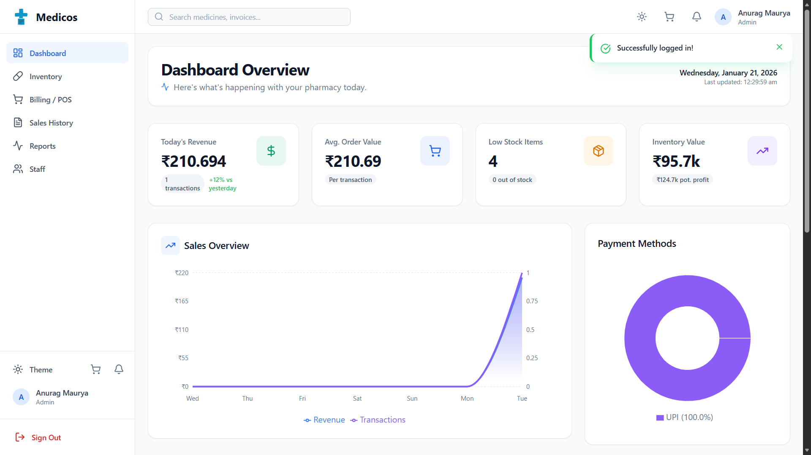
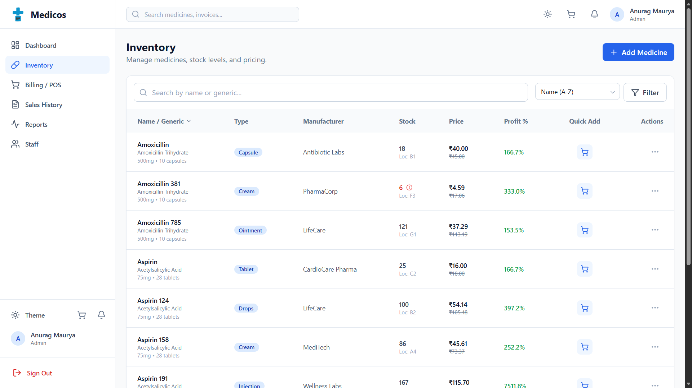
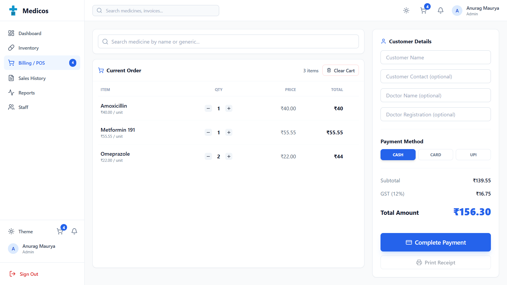
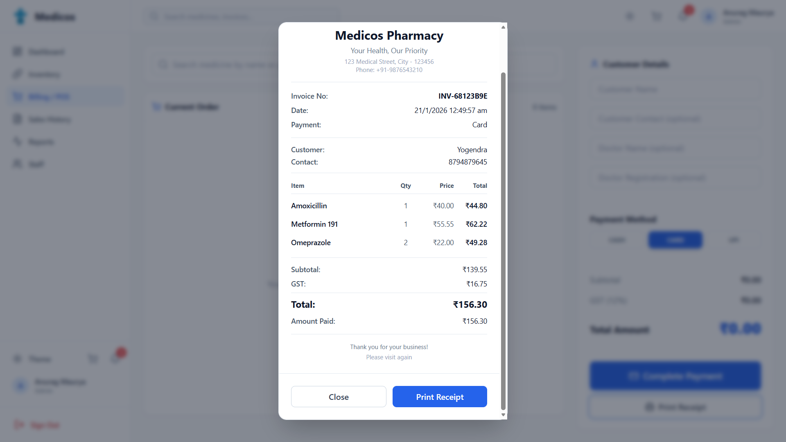
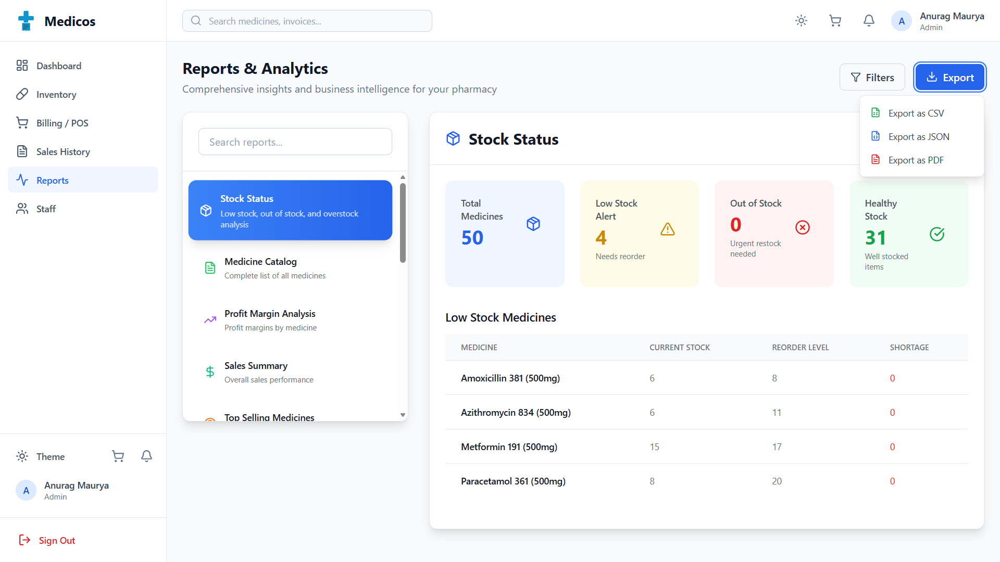

<div align="center">
  
  <h1>💊 Medicos Dashboard</h1>
  <p><strong>A Modern Pharmaceutical Management System Frontend</strong></p>

  <div>
    
    
    
    
  </div>

  <br />

  [Explore Docs](#-getting-started) •
  [View Features](#-key-features) •
  [Project Architecture](#-project-structure)
</div>

<hr />

## 🌟 Overview

**Medicos Dashboard** is a high-performance, responsive web application designed for pharmacies and medical stores. Built with **React 19** and **TypeScript**, it provides a seamless experience for managing inventory, tracking sales, generating reports, and handling staff permissions.

### 📸 Preview
> [!TIP]
> This frontend is optimized for both Dark and Light modes, ensuring readability in any clinical environment.

<div align="center">
  
</div>

<br />

## 🚀 Key Features

| Feature | Description |
| :--- | :--- |
| **📊 Analytics Dashboard** | Real-time visualization of inventory health, sales trends, and top products using `recharts`. |
| **📦 Inventory Management** | Comprehensive CRUD operations for medicines, including stock tracking and categories. |
| **🛒 POS & Billing** | Integrated cart system with receipt generation and multiple payment method support. |
| **📈 Sales Reporting** | Detailed sales logs, history, and financial performance metrics. |
| **🔔 Smart Notifications** | Automated alerts for low stock levels and transaction updates. |
| **👥 Staff Portal** | Management of user roles, staff details, and access control. |

<br />

<div align="center">
  
</div>

<div align="center">
  
</div>

<div align="center">
  
</div>

<div align="center">
  
</div>

<br />

## 🛠️ Tech Stack

- **Core:** [React 19](https://react.dev/), [TypeScript](https://www.typescriptlang.org/)
- **Build Tool:** [Vite](https://vitejs.dev/)
- **Routing:** [React Router 7](https://reactrouter.com/)
- **Charts:** [Recharts](https://recharts.org/)
- **Icons:** [Lucide React](https://lucide.dev/)
- **Styling:** Modern CSS (Utility-first approach)

<br />

## 📂 Project Structure

```bash
reactFrontend/
├── 📂 app/             # Core application logic (Router, Context, Providers)
├── 📂 components/      # Reusable UI components (Common, Layout)
├── 📂 features/        # Domain-specific modules
│   ├── 📂 auth/        # Authentication pages
│   ├── 📂 billing/     # Checkout and invoicing
│   ├── 📂 dashboard/   # Multi-chart analytics
│   ├── 📂 inventory/   # Product & Stock management
│   └── 📂 ...          # (Sales, Reports, Staff, etc.)
├── 📂 services/        # API clients and Mock data
└── 📂 types/           # Global TypeScript interfaces
```

<br />

## 🏁 Getting Started

### Prerequisites
- [Node.js](https://nodejs.org/) (v18 or higher)
- [npm](https://www.npmjs.com/) or [yarn](https://yarnpkg.com/)

### Installation

1. **Clone the repository**
   ```bash
   git clone https://github.com/Anurag-Shankar-Maurya/medicos.git
   cd medicos/reactFrontend
   ```

2. **Install dependencies**
   ```bash
   npm install
   ```

3. **Start the development server**
   ```bash
   npm run dev
   ```

### 🔨 Build for Production
```bash
npm run build
```

<br />

## 📄 Copyright & License
Copyright © 2026 Anurag Shankar Maurya. All rights reserved.

This project is proprietary software. Unauthorized copying, distribution, or use is prohibited. See the [LICENSE](LICENSE) file for the full legal notice.

<hr />

<div align="center">
  <sub>Developed by Anurag Shankar Maurya</sub>
</div>
